<br/>
<p align="center">

</a>
</p>
<br/>

# pli_rsync

 [README 日本語版](https://github.com/11ppm/pli_rsync/blob/main/README_JP.md)

## Overview
* Create a command using rsync to transfer backup files located in the `/plinode_backups/` directory of Plugin nodes from a VPS to a local machine.
* Create a command using rsync to transfer backup files from a local machine to the `/plinode_backups/` directory of Plugin nodes simultaneously.
* Please check if `/plinode_backups/` is available on the Plugin nodes before proceeding. If `/plinode_backups/` is not available, the command will not be executed.
* Compatible with various encryption types. The following is a list of SSH key types that may be detected by the script:
     * ssh-dss
     * ssh-rsa
     * ecdsa-sha2-nistp
     * ssh-ed25519
     * rsa-sha2-256
     * ssh-x25519
     * ssh-x448

  Therefore, this script detects the key types of DSA, RSA, ECDSA, Ed25519, RSA-PSS, x25519, and x448.

* Corresponds to both Japanese and English
     * Created translations.csv to correspond to Japanese and English
     * If necessary, we can also correspond to other languages, so please let us know.

## Features
1. Reads English and Japanese messages from a CSV file and displays them depending on the selected language.
2. Create a command to transfer the `/plinode_backups/` directory of Plugin nodes to the local machine.
3. At the same time, create a command to transfer backup files from the local machine to the `/plinode_backups/` directory of Plugin nodes.
4. rsync also supports ssh-key.

## About rsync
rsync is a file synchronization tool that is mainly used to synchronize files/directories in different locations. rsync can synchronize files between a local machine and a remote machine, and transfer files over the network.

The main feature of rsync is that it can transfer only the modified parts. That is, by calculating the differences between the source and destination files and transferring only the parts with differences, it operates very efficiently when transferring large amounts of data.

In addition, rsync has other advantages such as:

Ability to resume transfers from where they left off if interrupted
Faster transfer of multiple files than scp in some cases
Display of progress during transfers, making it easier to monitor transfer status
The plugin node probably has rsync installed, which can be checked with rsync --version. If it is not installed, please run the following command to install it.
```sh
sudo apt install rsync
```

## Git Clone the repository

Clone the repository, enter the pli_rsync directory, and change the permissions of pli_rsync.sh before running it.
```sh
git clone https://github.com/11ppm/pli_rsync
cd pli_rsync
chmod +x pli_rsync.sh
```

## Executing the script
```sh
./pli_rsync.sh
```

Select English or Japanese, and enter your password when prompted. 

"IP Address:123.456.789.10" is an example.
```sh
Select a language 言語を選択してください :

1. English
2. 日本語

Enter the number 数字を入力してください : 1

[sudo] password for Doraemon: 

                                       Your Plugin Node                                          
-----------------------------------------------------------------------------------------------------
IP Address           : 123.456.789.10
User                 : Doraemon
Backup Directory     : /plinode_backups/
Local Directory      : ~/Documents/plugin_node/CT-TEST_123.456.789.10/plinode_backups/
SSH Port             : 22
※ SSH key was not detected 
-----------------------------------------------------------------------------------------------------


                             Plugin Node    =====>>    Local Machine                             
-----------------------------------------------------------------------------------------------------

mkdir -p ~/Documents/plugin_node/CT-TEST_123.456.789.10/plinode_backups/ && rsync -avz --progress -e 'ssh -i ~/.ssh/id_rsa -p 22' Doraemon@123.456.789.10:/plinode_backups/ ~/Documents/plugin_node/CT-TEST_123.456.789.10/plinode_backups/

-----------------------------------------------------------------------------------------------------
To download backup file from the Plugin Node.run the following command in your local machine's terminal


                             Plugin Node    <<=====    Plugin Node                             
-----------------------------------------------------------------------------------------------------

rsync -avz --progress -e 'ssh -i ~/.ssh/id_rsa -p 22' ~/Documents/plugin_node/CT-TEST_123.456.789.10/plinode_backups/ Doraemon@123.456.789.10:/plinode_backups/

-----------------------------------------------------------------------------------------------------
To upload backup files from your local machine to the Plugin Node.run the following command in your terminal on the local machine.
Note: Replace ~/.ssh/id_rsa with the appropriate path and filename of your private key.
```

## Local Machine (for Linux/Mac)

Open the terminal and paste and execute the script.

Please check if /plinode_backups/ is available on the Plugin nodes before proceeding. If /plinode_backups/ is not available, the command will not be executed.

<!-- ## Local Machine (for Windows)

Please check if /plinode_backups/ is available on the Plugin nodes before proceeding. If /plinode_backups/ is not available, the command will not be executed.

1. Download Cygwin
     https://www.cygwin.com/
     
     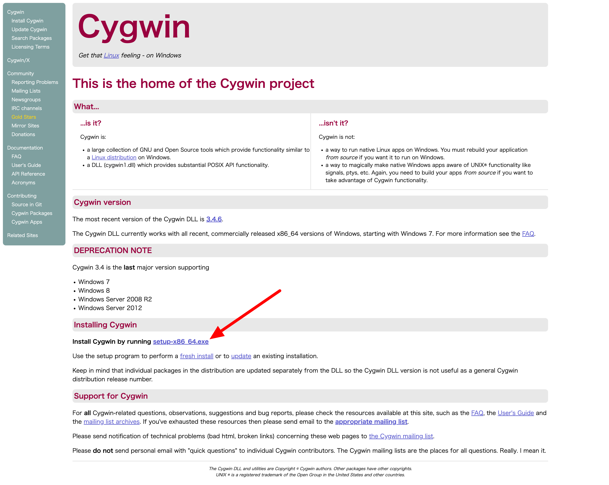


2. Install Cygwin
     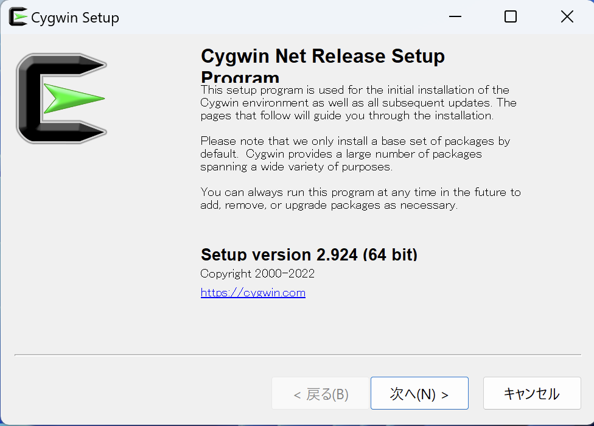

     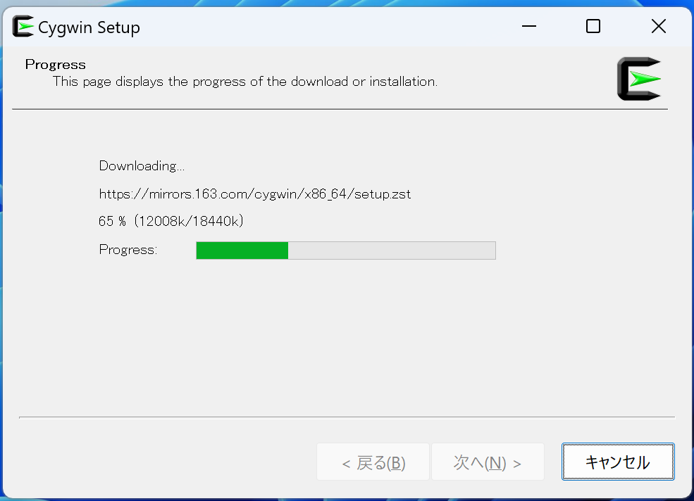
     

3. Select the installation packages
   1. Category → Net → Openssh
   2. Category → Net → rsync

     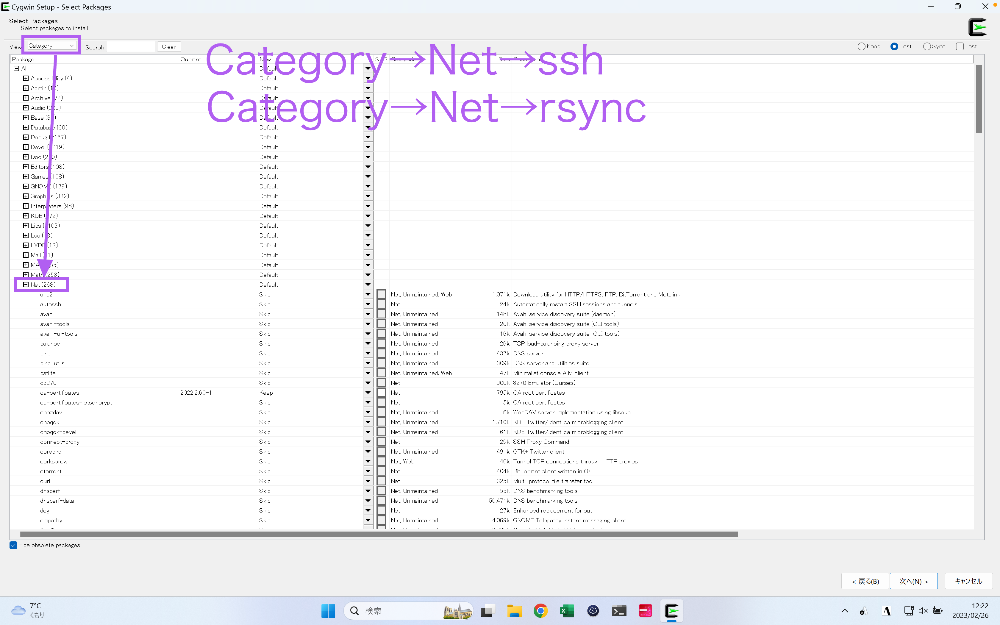

     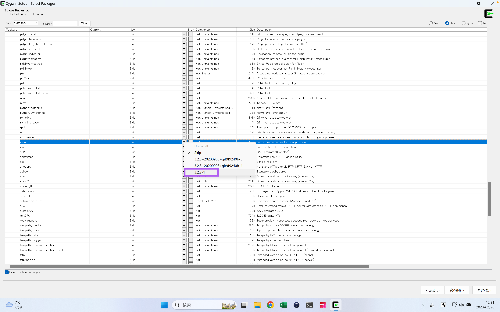

     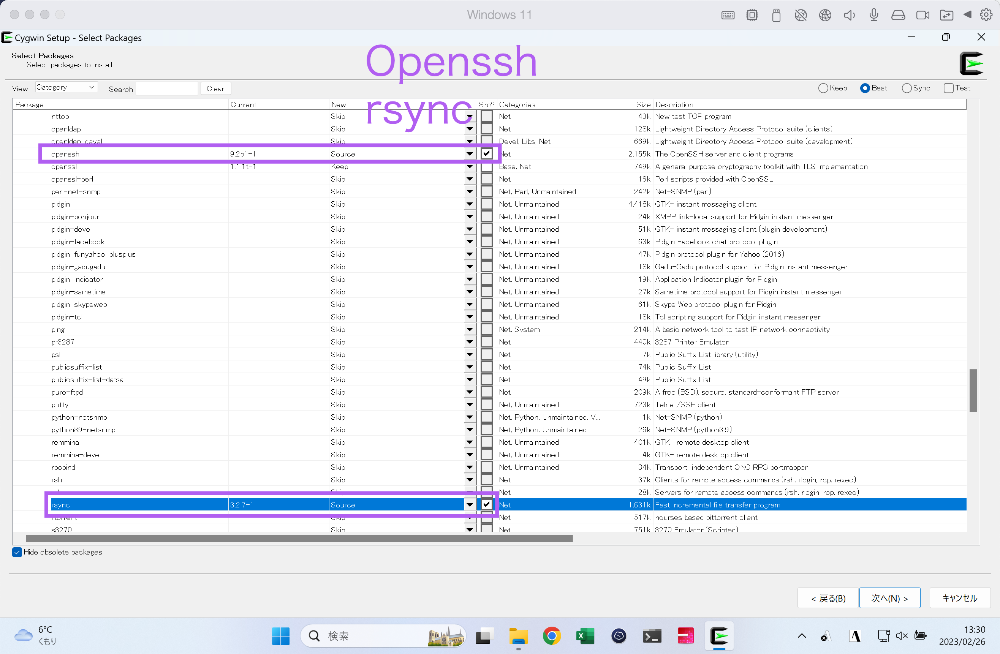

     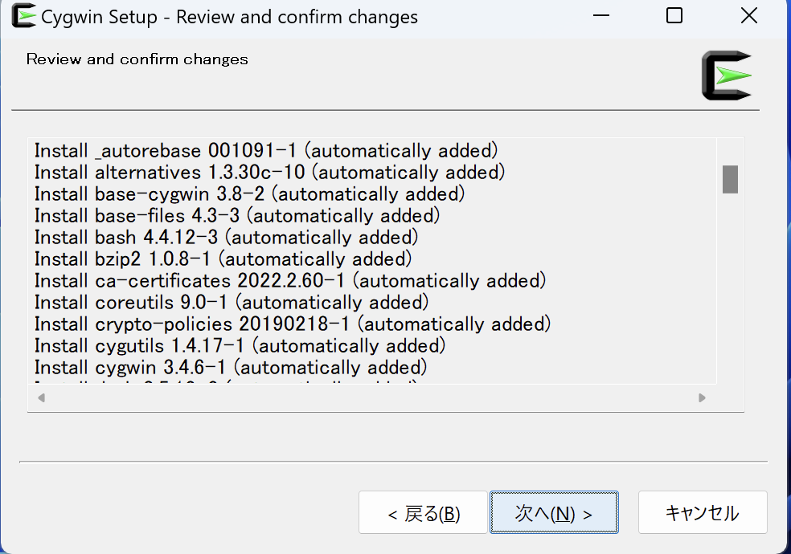

     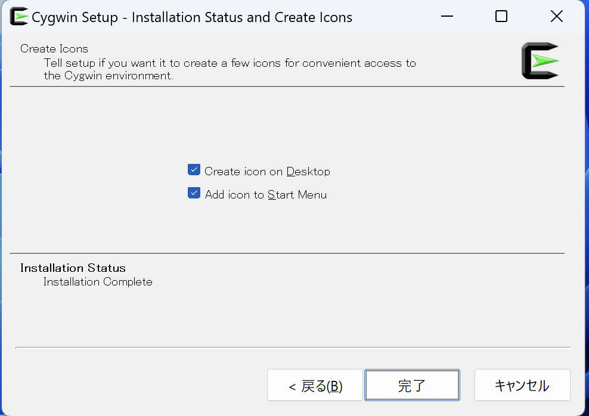


4. Launch Cygwin.
     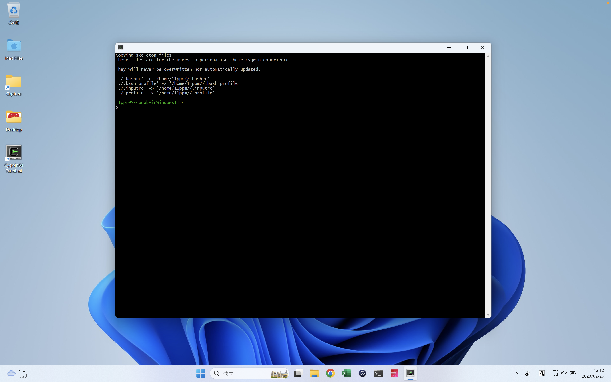


5. Make hidden files visible and ensure that `.ssh` is visible

     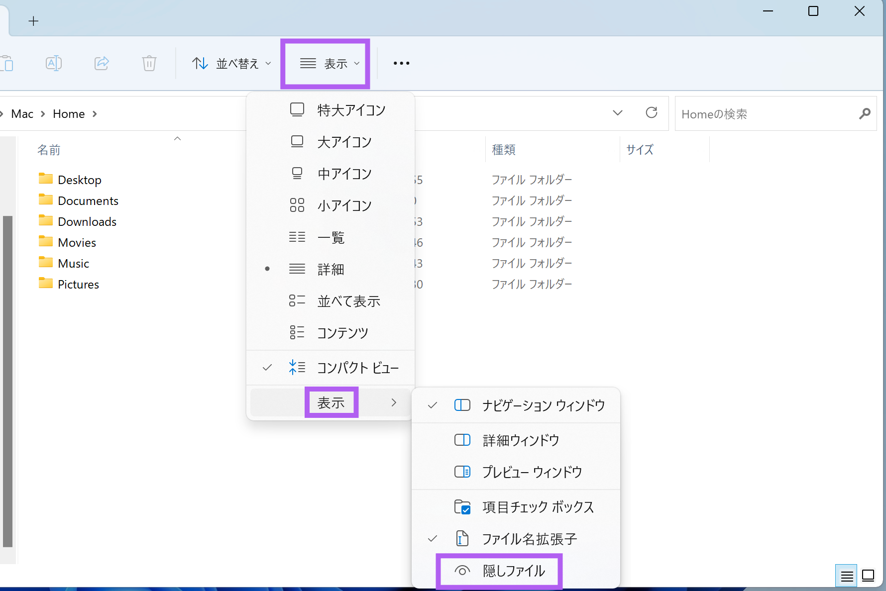

     

     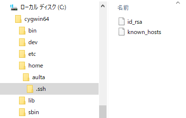


6. Execute rsync

     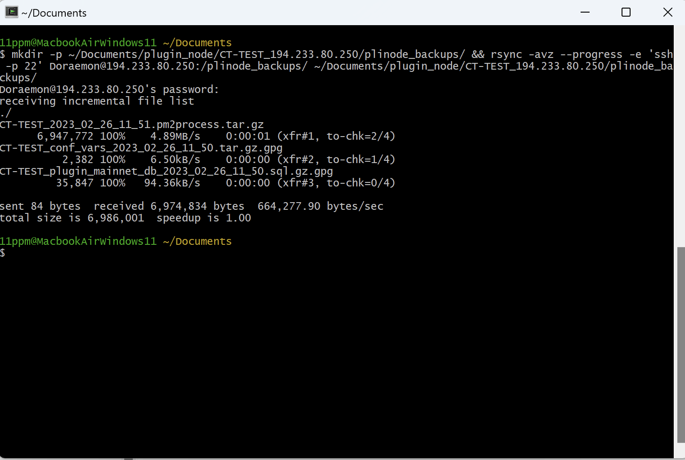

     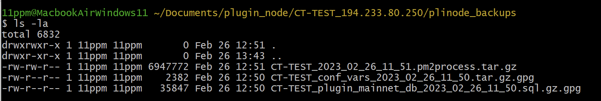
 -->

## Author

* @11ppm
   <!--  -->
